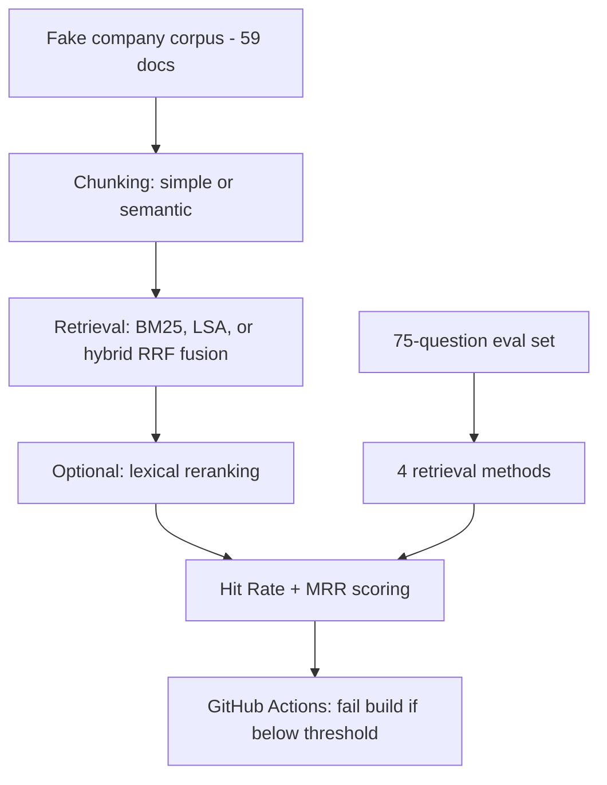

# RAG Retrieval Evaluation Harness

Four retrieval methods, benchmarked against a 75-question evaluation set built from a synthetic
company knowledge base — with an automated GitHub Actions gate that fails the build if retrieval
quality regresses. Runs fully offline: no API keys, no downloaded models, no external calls.

```
Method               Hit Rate     MRR        Questions
-------------------------------------------------------
simple_chunking      0.733        0.676      75
semantic_chunking    0.720        0.634      75
hybrid_search        0.787        0.687      75
reranking            0.800        0.743      75

Best method: reranking (hit rate 0.800)
PASSED: retrieval quality meets the required threshold.
```

## Why this project is different from a typical RAG demo

Most RAG tutorials show ONE pipeline working on a handful of hand-picked example questions. This
project instead treats retrieval as something you **measure and defend with evidence**: a fixed
75-question exam (with every "correct answer" traceable to a real sentence in a real document, so
the grading is honest), four genuinely different retrieval strategies run against the identical
exam, and a CI pipeline that automatically fails a pull request if someone's change quietly makes
retrieval worse. That last part — an evaluation gate wired into CI — is exactly how serious AI
teams guard against silent RAG quality regressions, and it's the piece almost every portfolio RAG
project skips entirely.

## The 4 methods compared

| Method | Chunking | Retrieval |
|---|---|---|
| `simple_chunking` (baseline) | Fixed-size character windows | BM25 keyword search |
| `semantic_chunking` | Topic-boundary-aware (TF-IDF sentence similarity) | BM25 keyword search |
| `hybrid_search` | Semantic chunking | BM25 + LSA semantic search, fused via Reciprocal Rank Fusion |
| `reranking` | Semantic chunking | Hybrid search, then a second-pass lexical reranker reorders the shortlist |

Everything runs on pure math libraries (`scikit-learn`, `rank-bm25`) with **no downloaded
embedding or reranking models** — see `docs/COURSE.md` for exactly why, and how to swap in a real
neural embedding/reranking model later with minimal code changes.

## The evaluation set

75 questions across 5 categories, generated from a single "answer key" (`scripts/facts.py`) so
every expected answer is guaranteed to actually exist, word-for-word, in the corpus:

- **Product specs** (24) — 8 fictional autonomous-robotics products, similar names and numbers,
  designed to be genuinely confusable (Rover X1 vs X2, Falcon-3 vs Falcon-5)
- **HR policies** (15), **Engineering procedures** (10), **Meeting decisions** (8) — mostly exact
  figures, some requiring light paraphrase understanding
- **Glossary terms** (18) — deliberately paraphrase-heavy, since the question rarely shares exact
  wording with the definition — this category is where keyword-only search struggles most

Each fake document also contains realistic corporate filler text surrounding the real fact, so
retrieval has to find a needle in a small haystack, not just read an isolated sentence.

## Architecture



## Project structure

```
├── run_eval.py                  # CLI entry point — this is what CI runs
├── app.py                       # Streamlit dashboard
├── scripts/
│   ├── facts.py                  # The 75-fact "answer key" — single source of truth
│   └── build_dataset.py          # Generates the corpus + questions.json from facts.py
├── src/
│   ├── corpus.py                  # Document loading
│   ├── chunking/
│   │   ├── simple.py               # Fixed-size chunking
│   │   └── semantic.py             # TF-IDF sentence-similarity chunking
│   ├── retrieval/
│   │   ├── sparse.py                # BM25
│   │   ├── dense.py                 # LSA/SVD semantic search
│   │   ├── hybrid.py                # Reciprocal Rank Fusion
│   │   └── reranker.py              # Lexical multi-signal reranking
│   ├── pipeline.py                # Assembles the 4 named methods
│   └── eval/
│       ├── metrics.py               # Hit Rate, MRR
│       └── harness.py               # Runs all questions x all methods
├── data/
│   ├── corpus/                    # 59 generated documents
│   └── eval/questions.json         # The 75-question eval set
├── tests/                         # 17 automated tests
└── .github/workflows/eval.yml     # CI: checkout, install, run eval, gate on threshold
```

## Quickstart

```bash
git clone <your-repo-url>
cd rag-eval-harness
python3 -m venv venv
source venv/bin/activate
pip install -r requirements.txt

python3 run_eval.py
# or
streamlit run app.py
```

The corpus and questions are already generated and committed — to regenerate them (e.g. after
editing `scripts/facts.py`):
```bash
cd scripts && python3 build_dataset.py
```

## Running the tests

```bash
pytest -v
```
17 tests covering chunking, each retrieval method, the scoring metrics, and full end-to-end
evaluation runs on a small hand-built mini-corpus — fast and independent of the full 75-question
corpus.

## The CI gate

`.github/workflows/eval.yml` runs on every push and pull request: checks out the code, installs
dependencies, runs `run_eval.py --threshold 0.75`. If the best method's hit rate falls below 0.75,
the script exits with a non-zero status code and GitHub Actions marks the check as failed —
automatically, with no one having to remember to check manually. The full per-question results are
also uploaded as a downloadable build artifact on every run.

## Tech stack

Python · scikit-learn (TF-IDF, SVD/LSA) · rank-bm25 (BM25) · Streamlit · pytest · GitHub Actions

## What I'd build next

- Swap the LSA dense retriever for a real neural embedding model (e.g. via `sentence-transformers`)
  and the lexical reranker for a real cross-encoder, and compare whether the *ranking* of methods
  changes — a genuinely interesting empirical question.
- Add a generation-quality eval layer on top of retrieval (does the final generated answer, not
  just the retrieved chunk, actually answer the question correctly?).
- Track hit-rate-over-time across CI runs to catch a *gradual* regression, not just a sudden one.

## Learn how it was built

See [`docs/COURSE.md`](docs/COURSE.md) for a full, concept-by-concept written walkthrough of every
idea in this project, explained from first principles.
